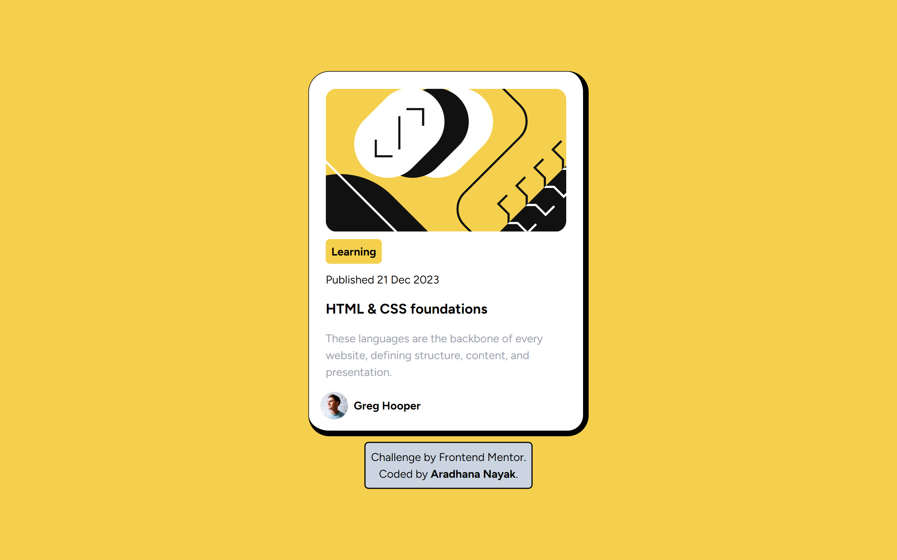

# Frontend Mentor - Blog preview card solution

This is a solution to the [Blog preview card challenge on Frontend Mentor](https://www.frontendmentor.io/challenges/blog-preview-card-ckPaj01IcS). Frontend Mentor challenges help you improve your coding skills by building realistic projects.

## Table of contents

- [Frontend Mentor - Blog preview card solution](#frontend-mentor---blog-preview-card-solution)
  - [Table of contents](#table-of-contents)
  - [Overview](#overview)
    - [The challenge](#the-challenge)
    - [Screenshot](#screenshot)
    - [Links](#links)
  - [My process](#my-process)
    - [Built with](#built-with)
    - [What I learned](#what-i-learned)
    - [Useful resources](#useful-resources)
  - [Author](#author)

## Overview

### The challenge

Users should be able to:

- See hover and focus states for all interactive elements on the page

### Screenshot



### Links

- Solution URL: [Github](https://github.com/aradhana1807/blog-preview-card)
- Live Site URL: [Live Site on Vercel](https://blog-preview-card-eosin-five.vercel.app/)

## My process

### Built with

- Semantic HTML5 markup
- Flexbox
- Tailwind CSS

### What I learned

Hover focused state when the blog title is hovered, the card is scaled up.

```css
.container {
  box-shadow: 10px 10px 0px 0px rgba(0, 0, 0, 1);
  transition: all 0.2s ease-in-out;
}

.container:hover {
  box-shadow: 15px 15px 0px 0px rgba(0, 0, 0, 1);
}
```

### Useful resources

- [Tailwind CSS](https://tailwindcss.com/docs/installation/play-cdn) - This helped me for styling purpose.

## Author

- Website - [Aradhana Nayak](https://re-myproject-gallery.vercel.app/)
- Frontend Mentor - [@aradhana1807](https://www.frontendmentor.io/profile/aradhana1807)
- Github - [@aradhana1807](https://github.com/aradhana1807)
